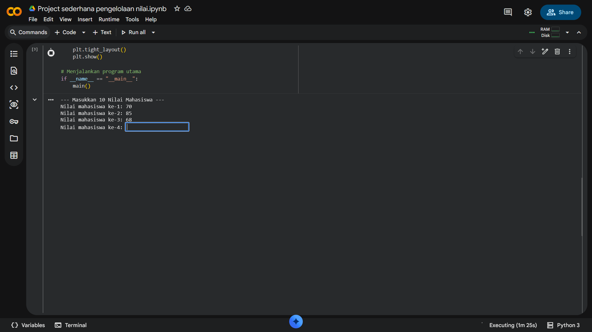
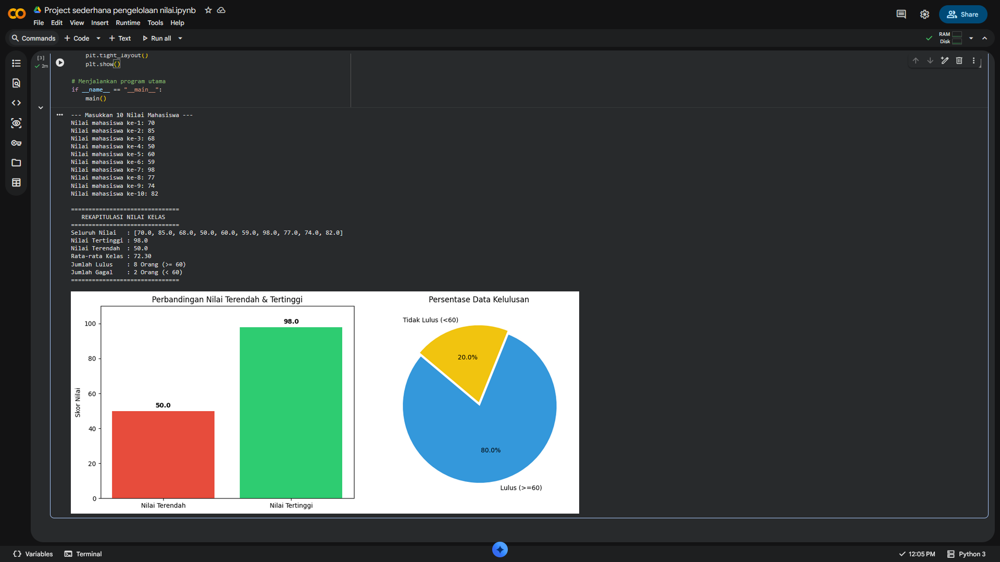

# Data Science Colab Repository

🔥 Repositori ini berisi script Python, struktur data, algoritma, dan proyek ilmu data yang siap dijalankan di Google Colab.

| Colab | Info - Script - Project Page |
| --- | --- |
|  | `Project_sederhana_pengelolaan_nilai`   [Sistem Pengelolaan Nilai Mahasiswa (Array)](#1-sistem-pengelolaan-nilai-mahasiswa-sederhana) |

---

## 📖 Documentation & Info

### 1. Sistem Pengelolaan Nilai Mahasiswa Sederhana
*(File: `Project_sederhana_pengelolaan_nilai.ipynb`)*

Sistem ini adalah program Python untuk menerima input 10 nilai mahasiswa, melakukan agregasi data (nilai tertinggi, terendah, rata-rata, kelulusan), dan memvisualisasikannya menggunakan grafik Matplotlib.

#### 📦 Penjelasan Konsep Array dalam Program
Dalam bahasa Python, konsep **Array** secara bawaan direpresentasikan menggunakan struktur data **List**. Berbeda dengan array statis di bahasa C/Java, List di Python bersifat *dinamis* (ukurannya bisa berubah-ubah) dan dapat menampung tipe data heterogen (meski dalam kasus ini kita hanya menyimpan nilai `float`).

Pada program ini, kita menerapkan array dengan cara:
1. **Inisialisasi**: Mendeklarasikan array kosong dengan sintaks `nilaiMahasiswa =[]`.
2. **Populating (Pengisian Data)**: Menambahkan data baru di akhir elemen array secara dinamis menggunakan metode `.append(nilai)` di dalam sebuah perulangan (`for loop`).
3. **Traversal (Pembacaan Data)**: Python mengevaluasi data array secara langsung saat kita memasukkannya ke dalam fungsi bawaan seperti `max()`, `min()`, `sum()`, atau dengan List Comprehension `[n for n in nilaiMahasiswa]`.

#### ⚡ Analisis Kompleksitas (Time & Space Complexity)
Mari kita asumsikan **`N`** adalah jumlah data mahasiswa (dalam program ini `N = 10`).

| Operasi | Time Complexity | Space Complexity | Penjelasan |
| :--- | :---: | :---: | :--- |
| **Input N Nilai** | $O(N)$ | $O(N)$ | Looping berjalan sebanyak N kali untuk meminta input. Nilai disimpan di array, sehingga memakan memori sebesar ukuran N. |
| **Cari Nilai Tertinggi (`max`)** | $O(N)$ | $O(1)$ | Fungsi `max()` secara internal melakukan iterasi satu per satu ke seluruh elemen array untuk mencari nilai terbesar. |
| **Cari Nilai Terendah (`min`)** | $O(N)$ | $O(1)$ | Fungsi `min()` bekerja dengan cara yang sama seperti `max()`, mengiterasi N elemen. |
| **Hitung Rata-rata (`sum/N`)** | $O(N)$ | $O(1)$ | Fungsi `sum()` menjumlahkan setiap elemen dalam array dengan melewati semua nilai (N iterasi). |
| **Hitung Jumlah Lulus** | $O(N)$ | $O(1)$ | Perintah `sum(1 for n in nilai if n >= 60)` akan memeriksa setiap elemen array satu per satu (iterasi N elemen). |
| **Visualisasi / Plotting** | $O(1)$ | $O(1)$ | Kita hanya memberikan data hasil agregasi (variabel tunggal) ke Matplotlib, sehingga ukurannya konstan tidak peduli seberapa besar `N`. |

**Kesimpulan Kompleksitas:**
- **Overall Time Complexity: $O(N)$** (Program berjalan secara linear bergantung pada jumlah mahasiswa. Jika ada 1.000 mahasiswa, waktu proses naik berbanding lurus, yang mana sangat efisien).
- **Overall Space Complexity: $O(N)$** (Hanya 1 array yang disimpan di memori seukuran N).

#### 💡 Refleksi Pembelajaran
Melalui pembuatan program sistem nilai berbasis Colab ini, beberapa poin pembelajaran yang didapatkan adalah:
1. **Efisiensi Algoritma Bawaan:** Menyadari bahwa fungsi bawaan Python seperti `max()`, `min()`, dan `sum()` sangat memudahkan penulisan kode (*clean code*), namun sebagai *programmer* kita tetap harus sadar bahwa di balik fungsi tersebut berjalan proses iterasi berkerangka kompleksitas $O(N)$.
2. **Pentingnya Validasi Input:** Konsep array tidak akan berguna maksimal jika data yang masuk (*garbage in*) bermasalah. Penggunaan balok `try-except ValueError` memastikan array murni hanya berisi tipe data angka dalam rentang 0-100, mencegah program *crash* di tengah eksekusi.
3. **Visualisasi Mengubah Angka Menjadi Wawasan (Insight):** Mengelola array mentah menjadi angka statistik belumlah cukup. Dengan mem-*parsing* data ekstrem dan persentase tersebut ke bentuk *Bar Chart* dan *Pie Chart* menggunakan Matplotlib, data array berubah menjadi wawasan yang langsung bisa dipahami oleh mata.

---
